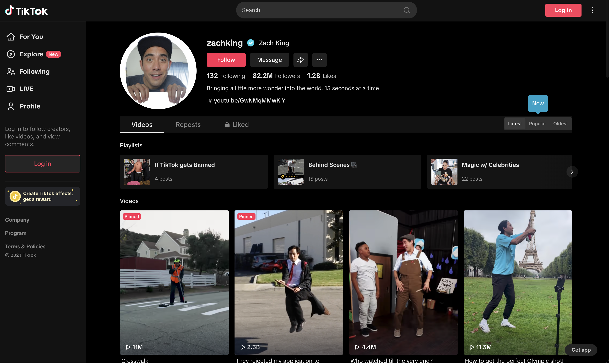

# TikTok API Guide

This guide will walk you through how to use the EnsembleData API to fetch data from TikTok. We'll cover how to fetch posts, users, comments, music, and more. Make sure to first check out the `Setup` section below to get setup with ensembledata's python library, which we'll use for fetching data throughout the guide.

## Table of Contents

[Setup](#setup) <br>
[Monitoring Hashtags](#monitoring-hashtags) <br>
[Monitoring Keywords](#monitoring-keywords) <br>
[User Info](#user-info) <br>
[User Posts](#user-posts) <br>
[User Followers](#user-followers) <br>
[Post Info](#post-info) <br>
[Post Comments](#post-comments) <br>
[Music](#music) <br>

Extras 📚 <br>
[What is a cursor?](#what-is-a-cursor) <br>


## Setup

(Optional) Create a virtual environment to run your python code in. <br>
This is not required, but keeps this project's dependencies separate from your other projects by installing them locally instead of globally.
```bash
python3 -m venv .venv
source .venv/bin/activate
```

Install the `ensembledata` python package, which we'll later use to fetch data from the EnsembleData API.
```bash
pip install ensembledata
```

Create an EnsembleData Client by passing in your API token. <br>
If you haven't got an API token, grab one for free by [creating an account](https://dashboard.ensembledata.com/) on our platform.
```python
from ensembledata.api import EDClient

client = EDClient("INSERT API TOKEN")
```

... and you're all ready to go! Let's dive into what you can do with the TikTok API.

<br>
<br>

## Monitoring Hashtags

There are two endpoints you can use to find TikTok posts using a specific hashtag. The first is the `Hashtag Search` which takes two parameters, a `hashtag` and a `cursor` [(What is a cursor?)](#cursors) and returns a list of about 20 posts.

Let's find some posts that use the hashtag `magic`.

```python
result = client.tiktok.hashtag_search(hashtag="magic", cursor=0)
posts = result.data["data"]

# Take a look at the first post
# print(posts[0])

print("Number of posts:", len(posts))
next_cursor = result.data.get("nextCursor")
```

To get the next batch of posts, we'll call the API again but this time with the next cursor value we got from the last request.

```python
result = client.tiktok.hashtag_search(hashtag="magic", cursor=next_cursor)
posts = result.data["data"]
next_cursor = result.data.get("nextCursor")
```

You can continue this process until you've fetched all the available posts for this hashtag. You'll know you've fetched all the posts once there is no 'nextCursor' in the response. 

The maximum number of posts you can fetch for a given hashtag varies depending on the popularity of the hashtag. Very popular hashtags tend to have a maximum of **4000-5000 posts**, while some hashtags may not have any posts at all.

> For more details on the Hashtag Search endpoint, check out the [Hashtag Search API docs](https://ensembledata.com/apis/docs#tag/Tiktok/operation/full_search_hashtag_tt_hashtag_recent_posts_get).

### Automatic Cursor Handling

The second endpoint is the `Full Hashtag Search`, whose functionality is a lot like it sounds. It fetches all the posts available for a given hashtag in one go. Under the hood, it uses the same `Hashtag Search` endpoint we used above, but it handles the cursor for you. Let's take a look.

```python
result = client.tiktok.full_hashtag_search(hashtag="magic")
posts = result.data["data"]
```

That easy! This endpoint provides two extra parameters we can use to configure the request. The first is the `max_cursor` which we can use to tell the API to stop fetching posts after a certain cursor value and the second is the `days` parameter, which we can use to filter out posts older than the specified number of days.

Here we are fetching those that use the hashtag `magic` and are at most 7 days old within the first 2000 posts.

```python
result = client.tiktok.full_hashtag_search(hashtag="magic", max_cursor=2_000, days=7)
posts = result.data["data"]
```

> For more details on the Full Hashtag Search endpoint, check out the [Full Hashtag Search API docs](https://ensembledata.com/apis/docs#tag/Tiktok/operation/full_search_hashtag_tt_hashtag_recent_posts_get).

<br>
<br>

# Monitoring Keywords

We've already seen how to monitor hashtags, and monitoring keywords is strikingly similar. Just like for hashtags, there are two endpoints for fetching posts based on a keyword. Let's first look at the `Keyword Search` API.

## Keyword Search API

[API Documentation](https://ensembledata.com/apis/docs#tag/Tiktok/operation/tiktok_keyword_search)

Here's how you can find posts for the keyword `tesla`. 

We'll also specify the `period` to search within, which can be one of 0, 1, 7, 30, 90, 180 days. We use `period=180` for this example, and as such, we'll only get posts from the last 180 days.


```python
from ensembledata.api import EDClient

client = EDClient("API_TOKEN")
result = client.tiktok.keyword_search(
    keyword="tesla"
    period="180",
)

posts = result.data["data"]
print("Number of posts:", len(posts))

# We'll need this later!
next_cursor = result.data.get("nextCursor")
```

**Output**:
```bash
Number of posts: 20
```

Great! We've got 20 posts, now let's see how we can get more.

### Extra parameters

For a complete overview of the available parameters, please refer to the [API Documentation](https://ensembledata.com/apis/docs#tag/Tiktok/operation/tiktok_keyword_search) for this endpoint.

#### Specify country

TikTok presents different posts for a keyword based on the country the user is in. The `country` parameter allows you to take advantage of this by specifying which country you would like to do the keyword search for. 

The country is specified via the [ISO 3166-1 alpha-2](https://en.wikipedia.org/wiki/ISO_3166-1_alpha-2) country code. For example, let's search using the keyword `tesla` in the United States.


```python
result = client.tiktok.keyword_search(
    keyword="tesla", 
    period="180", 
    country="US"
)
```


Warning 🚨

This doesn't necessarily mean that the posts returned will be only from the specified country, but rather that the posts are those shown in that country.


#### Sort posts

You can specify how to sort the posts via the `sorting` parameter which 

- `0` - Sorts the posts by relevance (default)
- `1` - Sorts the posts by likes

```python
result = client.tiktok.keyword_search(
    keyword="tesla", 
    period="180", 
    sorting="1"
)
```

### Fetching more posts

To get more posts, we'll join forces with our friend the cursor again. To get the next batch of posts, we'll call the `Keyword Search` API again but this time with the next cursor value we got from the previous request.

```python
result = client.tiktok.keyword_search(keyword="tesla", cursor=next_cursor)
posts = result.data["data"]
next_cursor = result.data.get("nextCursor")
```

You can continue this process until you've fetched all the available posts for this keyword. You'll know you've fetched all the posts once there is no 'nextCursor' in the response.

### Cursor handling example

Here's an example of how you could manually handle the cursor to fetch posts for a given keyword.

```python
posts = list()
cursor = None

for _ in range(10):
    result = client.tiktok.keyword_search(keyword="tesla", cursor=cursor)
    posts.extend(result.data["data"])
    cursor = result.data.get("nextCursor")
    
    # If there is no next cursor, we've fetched all the available posts
    if cursor is None:
        break

print("Number of posts:", len(posts))
```

**Output**:
```bash
Number of posts: 200
```

Handling the cursor manually like this is perfectly fine and not all too difficult, however, the next section will show you how you can get the EnsembleData API to do this for you.

## Full Keyword Search API

[API Documentation](https://ensembledata.com/apis/docs#tag/Tiktok/operation/tiktok_full_hashtag_search)

### Automatic cursor handling

The `Full Keyword Search` API is very similar to the `Keyword Search` API, but it automatically handles the cursor for you. This means you can fetch all the posts for a keyword without having to worry about the cursor.

```python
result = client.tiktok.full_keyword_search(
    keyword="tesla", 
    period="180"
)
posts = result.data["data"]
print("Number of posts:", len(posts))
```

**Output**:

```bash
Number of posts: 1366
```

There we go! We've fetched all the posts for the keyword `tesla` in one API call without having to worry about the cursor.

#### Warning 🚨

The `Full Keyword Search` API can take quite a long time to respond, due to all the requests it has to send internally. Make sure to set a high enough timeout (> 10 mins) if you are configuring your own HTTP requests. If you are using one of the EnsembleData API packages, this is handled for you!

### Extra parameters

The `Full Keyword Search` API supports mostly the same parameters as the `Keyword Search` API. For a complete overview of the available parameters, please refer to the [API Documentation](https://ensembledata.com/apis/docs#tag/Tiktok/operation/tiktok_full_keyword_search) for this endpoint.


## User Posts

The EnsembleData TikTok API enables you to fetch a user's posts and, if publicly available, the posts they have liked. Let's first look at an example profile to get our bearings. 

Here we've got the user profile of [Zach King](https://www.tiktok.com/@zachking), a popular TikTok creator.



## Where to find user posts
The user posts we will get are those that appear in the `Videos` tab of the user's profile. By default, these post are sorted from newest to oldest, and the API, which we will look at below, retrieves the posts in this same order. 

Warning 🚨

Some users have pinned posts, indicated by the red `pinned` label on the post in the `Videos` tab. These posts will appear first in the responses from the EnsembleData API, just as they do on TikTok. Be mindful that these pinned posts are in most cases not the most recent posts by the user. As such you may need to filter these posts out depending on your use case.

## Where to find a user's liked posts

Additionally, we can see that `Zach King` has not made his liked posts public, as indicated by the lock 🔒 on the `Liked` tab to the right of the `Videos` tab. Therefore, we won't be able to fetch his liked posts. 


## User Posts From Username API

[API Documentation](https://ensembledata.com/apis/docs#tag/Tiktok/operation/tiktok_user_posts_from_username)

For the `User Posts From Username` endpoint we'll need a `username`, obviously, and a `depth` parameter, less obviously. What is the `depth` parameter, you ask? 

The `depth` parameter tells the API how many chunks of posts to fetch. Each chunk contains 10 posts for this endpoint. Therefore, sending a `depth` of 1 will fetch 10 posts, a `depth` of 2 will fetch 20 posts, and so on. You *must* provide a depth parameter, to tell us how many posts to get.

In addition, the posts 

Tip ✅

For more information of using `depth` throughout the EnsembleData API, see the ["What is depth?"](/faqs/depth) page.

We're ready to fetch some user posts. ¡Vamos!


```python
from ensembledata.api import EDClient

client = EDClient("API_TOKEN")
result = client.tiktok_user_posts_from_username(
    username="zachking",
    depth=1,
)

posts = result.data["data"]
next_cursor = result.data["nextCursor"] # We'll need this later

print("Posts:", len(posts))
```

**Output:**
```bash
Posts: 10
```

Great, we've got the most recent 10 posts! Well... not quite; the user may have pinned some posts at the top of their profile. Note: it's possible, though unlikely, the pinned posts are the most recent. To be sure, you should check their timestamps.

### Filtering out pinned posts

For simplicity, let's see how we can filter the pinned posts out.

```python
posts = [post for post in posts if not post["is_top"]]
print("Posts:", len(posts))
```

**Output:**
```bash
Posts: 8
```


Piece of cake! 

### Fetching more posts

Now let's talk about the options you have for fetching more posts.

#### Using depth

The simplest way to fetch more posts is to simply send a larger `depth` parameter. For example, to fetch 50 posts, instead of 10, you would send a `depth` of 5 instead of 1. However, if you've already sent a request to get the first 10 posts, sending a `depth` of 5 will get you 50 posts, **including the 10 you already have**... which is not ideal. In this case, you may want to use the `cursor` parameter instead.

#### Using the cursor

Each response contains a `nextCursor` value. You can use this cursor to get the next chunk of posts. Here's how you can do it:


```python
result = client.tiktok_user_posts_from_username(
    username="zachking",
    depth=1,
    cursor=next_cursor, 
)

next_posts = result.data["data"]
next_cursor = result.data.get("nextCursor")
```

#### Combining depth and cursor

You can also combine the `depth` and `cursor` parameters to get a specific number of posts, starting from where you left off. For example, let's get the first 10 posts, then get the next 50 posts if there is a `nextCursor`. If there is no next cursor, it means there are no more posts.

```python
posts = list()
result = client.tiktok_user_posts_from_username(
    username="zachking",
    depth=1,
)
posts.extend(result.data["data"])
next_cursor = result.get("nextCursor")

if next_cursor is not None:
    result = client.tiktok_user_posts_from_username(
        username="zachking",
        depth=5,
        cursor=next_cursor,
    )
    posts.extend(result.data["data"])

print("Posts:", len(posts))
```

**Output:**
```bash
Posts: 60
```

### Specify an oldest timestamp

The `User Posts From Username` endpoint also accepts an `oldest_createtime` parameter ([unix timestamp](https://en.wikipedia.org/wiki/Unix_time)). This parameter acts as a stopping condition when used in combination with the `depth` parameter. Internally, `depth` represent the number of requests the EnsembleData API will try to send in sequence. If you specify an `oldest_createtime`, the API will stop fetching posts when it reaches a post with a timestamp older than the one you specified. 

For example, you may want to fetch up to 100 of a user's posts, but only those which are more recent than a certain date. You can do this by specifying a `depth` of 10, and an `oldest_createtime` of the cutoff time.


```python
result = client.tiktok_user_posts_from_username(
    username="zachking",
    depth=10,
    oldest_createtime=1723806137,
)
```

Warning 🚨
    
The `oldest_createtime` only tells the API when to stop fetching posts. However, the posts are fetched in chunks. In the last chunk of fetched posts there may be some posts newer, and some older than the `oldest_createtime` you specified. Therefore, some of the posts returned by the API are likely to be older than the `oldest_createtime` you specified. You should filter these out in your application if required. We don't filter them out to give you the flexibility to decide what to do with them.


### Alternative method

You can optionally tell the API to use a different method to scrape the user's posts by passing `alternative_method` as `True`. The reponse payload will differ from the default method. We suggest you peruse the response payloads of both methods to see which one suits your needs better.

```python
result = client.tiktok_user_posts_from_username(
    username="zachking",
    depth=1,
    alternative_method=True,
)
```

## User Posts From Secuid API

[API Documentation](https://ensembledata.com/apis/docs#tag/Tiktok/operation/tiktok_user_posts_from_secuid)

This endpoint is functionally the same as the `User Posts From Username` API, the only difference being you need to supply the `secuid` of the user instead of the `username`. 

```python
result = client.tiktok_user_posts_from_secuid(
    sec_uid="MS4wLjABAAAA...",
    depth=1,
)
```

The endpoint accepts all the same parameters as the `User Posts From Username` API. Please refer to the above sections for more details on how you can use this endpoint.

<br>
<br>

## User Info

There are a few different ways we can get TikTok user information via the API. Similarly to when fetching user posts, we need to provide either a `username` or a `sec_uid` (secondary user id).

Here's just some of the key information you can find with the user info endpoints:

- region
- nickname
- username
- total likes
- followers
- number of posts
- bio / signature
- verified status
- profile picture


> You'll also find the `uid` (user id) and the `sec_uid` (secondary user id) which you may need for fetching data from other endpoints.


To see all the available information, head over to the documentation for the following endpoints and check out the response samples in the right panel.

### User Info from Username

[View Documentation](https://ensembledata.com/apis/docs#tag/Tiktok/operation/tiktok_user_info_from_username)


```python
result = client.tiktok.user_info_from_username(
    username="zachking"
)
```

### User Info from Secuid

[View Documenation](https://ensembledata.com/apis/docs#tag/Tiktok/operation/tiktok_user_info_from_secuid)

<!-- TODO: Talk about what else is available with alternative method -->

```python
result = client.tiktok.user_info_from_secuid(
    sec_uid="MS4wLjABAAA..."
)

user = result.data["user"]
print("Username:", user["unique_id"])
print("Nickname:", user["nickname"])
print("Followers:", user["follower_count"])
print("Posts:", user["aweme_count"])
print("Likes:", user["total_favorited"])
```

 The `user_info_from_secuid` endpoint has an optional `alternative_method` parameter, which when set to `True` will send back a different payload which contains some different information. There is a lot of overlap between the different responses for `alternative_method=True` and `alternative_method=False`, but each contain some information the other does not. For example, `alternative_method=True` gives you information about the account's category.

### User Liked Posts

[View Documenation](https://ensembledata.com/apis/docs#tag/Tiktok/operation/tiktok_user_liked_posts)

If this information is publicly avaiable we can also fetch the posts that a user has liked. To do so we'll need the user's `sec_uid`.

```python
result = client.tiktok.user_liked_posts(
    sec_uid="MS4wLjABAAA...",
)
posts = result.data["liked_posts"]
next_cursor = result.data.get("nextCursor")
```

If the next cursor value is not null, we can fetch more posts by making another request likes so [(What is a cursor?)](#cursors).

```python
result = client.tiktok.user_liked_posts(
    sec_uid="MS4wLjABAAA...",
    cursor=next_cursor
)
more_posts = result.data["liked_posts"]
next_cursor = result.data.get("nextCursor")
```

<br>
<br>

## User Followers

Now, let's dive into the data you can retreive around followers on TikTok.

### Followers

[Documentation](https://ensembledata.com/apis/docs#tag/Tiktok/operation/tiktok_user_followers)

Our TikTok Followers API allows you to retrieve a user's most recent 5000 followers, i.e the last 5000 people to follow this user. To do so we'll require both the the user id and the secondary user id.

```python
result = client.tiktok.user_followers(
    id="6784819479778378757",
    sec_uid="MS4wLjABAAAAQ45...",
)

followers = result.data["followers"]
follower_count = result.data["total"]
next_cursor = result.data["nextCursor"]
```

A single request will return 100 followers, to get more send another request, this time passing in the cursor value we got from the previous request ([What is a cursor?](#cursors)). Note: the maximum you can retrieve is 5000.

### Followings

[Documentation](https://ensembledata.com/apis/docs#tag/Tiktok/operation/tiktok_user_followings)

Additionally, you can fetch the 'followings', which are the people the user themself follows. This endpoint works very similarly to the endpoint to fetch followers:

```python
result = client.tiktok.user_followings(
    id="6784819479778378757",
    sec_uid="MS4wLjABAAAAQ45...",
)

followers = result.data["followings"]
follower_count = result.data["total"]
next_cursor = result.data.get("nextCursor")
next_page_token = result.data.get("nextPageToken")
```

A single request will return 100 followings. To get more you'll need to use the `cursor` AND the `page_token`. Let's see how we can get the next chunk of followings below:

```python
result = client.tiktok.user_followings(
    id="6784819479778378757",
    sec_uid="MS4wLjABAAAAQ45...",
    cursor=next_cursor,
    page_token=next_page_token,
)

next_cursor = result.data.get("nextCursor")
next_page_token = result.data.get("nextPageToken")
```

Easy! We successfully used the cursor to get more results. You can continue this process until there is no `nextCursor` or `nextPageToken` in the response, which indicates that there are no more retrievable results.

<br>
<br>

## Post Info

Let's look at fetching the data for a post on TikTok. The most basic way to do this is using the `post_info` endpoint which we'll take a look at first.

Here's just some of the key information you can find with the post info endpoints:

- plays, likes, comments, downloads, shares, collects, forwards
- video url
- video cover
- post description
- hashtags
- music info
- language
- region
- author info


### Single Post

[Documentation](https://ensembledata.com/apis/docs#tag/Tiktok/operation/tiktok_post_info)

Here we just need to supply the url for the TikTok post. You can easily find this by navigating to the post in your browers and copying the page url from the search bar. It should look like what we seen in the example below:

```python
result = client.tiktok.post_info(
    url="https://www.tiktok.com/@daviddobrik/video/7165262254722534698",
)
post = result["data"][0]
author_data = post["author"]
music_data = post["music"]
post_desc = post["desc"]
likes = post["statistics"]["digg_count"]
plays = post["statistics"]["play_count"]
shares = post["statistics"]["share_count"]
comments = post["statistics"]["comment_count"]
```

### Multiple Posts

If need to fetch data for many TikTok posts at once, then this is the endpoint for you. For this endpoint you'll need to extract the post ids and pass them in as a list. Note that the endpoint accepts a maxium of 100 post ids at once. If more than 100 ids are supplied the API will return an error notifying you of this.

> You can either find the post ids via other endpoints or you can find them at the end of the post url as seen in the previous example.

```python
result = client.tiktok.multi_post_info(
    aweme_ids=[
        "7210531475052236078", 
        "7102806710334606597", 
        "710280671033460623434597"
    ],
)
posts = result["data"]
```

<br>
<br>

# Post Comments

## Post Comments API

[API Documentation](https://ensembledata.com/apis/docs#tag/Tiktok/operation/tiktok_post_comments)

To fetch comments we'll first need to find the post id, also known as the `aweme_id`.

Where can I find the `aweme_id`? 🙋‍♂️
     
You can find the `aweme_id` in the URL of the post. For example, in the URL `https://www.tiktok.com/@username/video/6849400000000` the `aweme_id` is `6849400000000`. Otherwise, you can also find the `aweme_id` in the response for any of the endpoints which return post data.

Let's fetch some comments!


```python
from ensemble.api import EDClient

client = EDClient("API_TOKEN")
result = client.tiktok.post_comments(aweme_id="6849400000000")

comments = result.data["comments"]
next_cursor = result.data("nextCursor")

print("Comments fetched:", len(comments))
print("Total comments:", result.data["total"])
```

**Output:**

```bash
Comments fetched: 30
Total comments: 136
```

Sweet! Let's see what data we retrieved. 

### Comment data

Inside each comment object you'll find everything you need to know about the comment, including a variety of data about the commenter.

```python hl_lines="5"
comment = comments[0]
user = comment["user"]

print("=== First comment ===")
print("comment_id:", comment["cid"]) # We'll need this for fetching replies!
print("timestamp:", comment["create_time"])
print("text:", comment["text"])
print("likes:", comment["digg_count"])
print("replies:", comment["reply_comment_count"])
print("username:", user["unique_id"])
```

If you need to get the more details about the commenter, the `username`, `uid` and `sec_uid` fields will be useful for calling other API endpoints such as `User Info From Secuid`, `User Posts From Username` or `User Followers`.

```python
print("sec_uid:", user["sec_uid"])
print("user_id:", user["uid"])
```

### Fetching more comments

As you can see the `Post Comments` API gives us up to 30 comments per request. Using the `nextCursor` we got from the previous response, we can get the next batch of comments.

```python
result = client.tiktok.post_comments(
    aweme_id="6849400000000", 
    cursor=next_cursor
)
comments = result.data["comments"]
next_cursor = result.data.get("nextCursor")
```

You can repeat this step over and over until you've fetched as many comments as you need.

### Cursor handling example

Here's an example of how you can handle the cursor in a loop to fetch comments for a given post.

```python
comments = list()
cursor = None
ITERATIONS = 10

for _ in range(ITERATIONS):
    result = client.tiktok.post_comments(
        aweme_id="6849400000000", 
        cursor=cursor
    )
    comments.extend(result.data["comments"])
    cursor = result.data.get("nextCursor")
    
    # If there is no next cursor, we've fetched all the available comments
    if cursor is None:
        break

print("Number of comments:", len(comments))
```

**Output:**

```bash
Number of comments: 300
```

## Post Comment Replies API

[API Documentation](https://ensembledata.com/apis/docs#tag/Tiktok/operation/tiktok_post_comment_replies)

Especially on very popular posts TikTok, you'll find that comments can get quite a lot of replies. Scraping replies can help extract more insights from the comment section, so let's see how it's done.

```python
result = client.tiktok.post_comment_replies(
    aweme_id="6849400000000", 
    comment_id="6849400000000"
)
```

Pretty simple, we just need to specify which `comment_id` we want to fetch replies for. We saw where to get the comment id from in a [previous section](#comment-data).

The structure of the response is almost identical to that of the `Post Comments` API, which we saw in the last section.

```python
replies = result.data["comments"]
print("Replies fetched:", len(replies))
print("Total replies:", result.data["total"])

next_cursor = result.data.get("nextCursor")
```

**Output:**

```bash
Replies fetched: 30
Total replies: 66
```

Ok great, but I want those other 36 replies too! Let's fetch them.

### Fetching more replies

Just like with the `Post Comments` API, we can use the `nextCursor` to fetch more replies. Let's loop through the replies until we've fetched them all.

```python
replies = list()
cursor = None
requests_sent = 0

while True:
    result = client.tiktok.post_comment_replies(
        aweme_id="6849400000000", 
        comment_id="6930120000000",
        cursor=cursor
    )
    replies.extend(result.data["comments"])
    cursor = result.data.get("nextCursor")
    requests_sent += 1
    
    # If there is no next cursor, we've fetched all the available replies
    if cursor is None:
        break

print("Replies:", len(replies))
print("Requests sent:", requests_sent)
```

**Output:**

```bash
Replies: 66
Requests sent: 3
```

<br>
<br>

# Music

Music is another very important part of the TikTok ecosystem. The EnsembleData API has several endpoints that allow you to interact with music data.
Let's start by looking at how we can find music using a keyword.

## Music Search API

[API Documentation](https://ensembledata.com/apis/docs#tag/Tiktok/operation/tiktok_music_search)

Aside from supplying a keyword, you'll need to specify how you want the results to be filtered and sorted. Let's take a look at the options:

### Sorting

- `0`: sort by `relevance` (best keyword match, according to TikTok)
- `1`: sort by `most_used` music
- `2`: sort by `most_recent` music
- `3`: sort by `shortest` music
- `4`: sort by `longest` music

### Filtering

- `0`: No filter applied
- `1`: only search music
- `2`: only search music creators

```python
from ensembledata.api import EDClient

client = EDClient("API_TOKEN")
result = client.tiktok.music_search(
    keyword="classical",
    sorting="0",
    filter_by="0",
)

music = result.data["music"]
next_cursor = result.data.get("nextCursor")

# Show the first music result
print("Title:", music[0]["title"])
print("Author:", music[0]["author"])
print("Music ID:", music[0]["mid"])
```


### Fetch more results

To search for more music, simply add the `cursor` parameter to the request, using the `nextCursor` value you got from the previous request.

[What is a cursor?](/faqs/cursor)

```python

if next_cursor is None:
    print("There are no more results")

else:
    result = client.tiktok.music_search(
        keyword="classical",
        sorting="0",
        filter_by="0",
        cursor=next_cursor,
    )
```

## Music Posts API

[API Documentation](https://ensembledata.com/apis/docs#tag/Tiktok/operation/tiktok_music_posts)

Once you've got your hands on a music ID, you can use it to fetch posts that use that music.

```python

result = client.tiktok.music_posts(
    music_id="6874200777853661442",
)

posts = result.data["aweme_list"]
next_cursor = result.data.get("nextCursor")
```

### Fetching more posts

To fetch more posts, use the `cursor` parameter.

```python
if next_cursor is None:
    print("There are no more results")

else:
    result = client.tiktok.music_posts(
        music_id="6874200777853661442",
        cursor=next_cursor,
    )
```

## Music Details API

[API Documentation](https://ensembledata.com/apis/docs#tag/Tiktok/operation/tiktok_music_details)

If you've got a music ID and want to get more information about it, you can use the `Music Details` endpoint.

```python
result = client.tiktok.music_details(
    music_id="7063948643480488709",
)

# The number of videos which use this music item
print("Usage count", result.data["user_count"])
```

In the response payload you can find links to the music itself, artist/author information, duration etc. We recommend perusing the response payload to see what else you can get from this endpoint.


<br>
<br>

## What is a cursor? 📚

So you don't know what a cursor is? Fear not, we've got you covered.

Many APIs include endpoints that allow you to fetch items from a list, however, they often don't return all the items at once. Instead, they return a chunk of items from the list and send you back a cursor. 

The cursor is like a bookmark, it tells us where we're up to, or how far we are through the list of items. When we want to get the next chunk of items from the list we send the cursor with our next request to the API, so that it knows where to get the next chunk of items from.

Imagine the API we're using has information on 100 books. We want to fetch this data, so we make a request to get the books:

```python
result = api.get_books()
print(result.data)
```

Let's take a look at what the api responded with:

```python
{
    "data": [
        {"title": "Book 1", ...},
        {"title": "Book 2", ...},
        ...
        {"title": "Book 20", ...},
    ],
    "nextCursor": 20
}
```

Interesting, it only sent us the first 20 books, but it did also send us a `nextCursor`.

Let's use the `nextCursor` to get more books.

```python
result = api.get_books(cursor=20)
print(result.data)
```

```python
{
    "data": [
        {"title": "Book 21", ...},
        {"title": "Book 22", ...},
        ...
        {"title": "Book 40", ...},
    ],
    "nextCursor": 40
}
```

Great, it sent us the next 20 books, and another `nextCursor` we can use to get more books.

Viola, this is how you can use a cursor to iterate over a list of items via API.

### References

The contents of this guide are taken from the [Definitive EnsembleData Guide](https://ensembledata.github.io/ensembledata-guide). Check it out for a more extensive look into the EnsembleData API with code examples in various languages.

#### Other References

- [EnsembleData API Documentation](https://ensembledata.com/apis/docs)
- [EnsembleData TikTok API](https://ensembledata.com/tiktok-api)
- [EnsembleData TikTok Scraping Overview](https://ensembledata.com/tiktok-api/scraping-overview)
- [EnsembleData python package](https://github.com/ensembledata/ensembledata-python)


